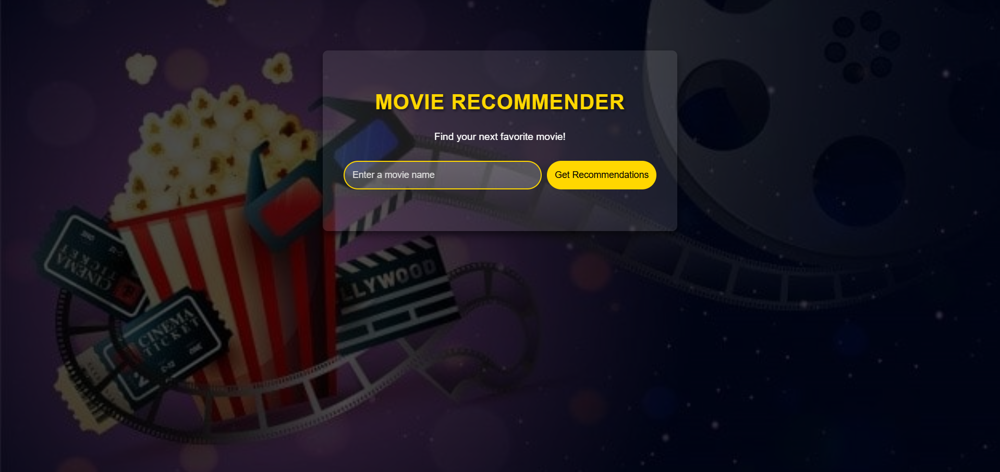
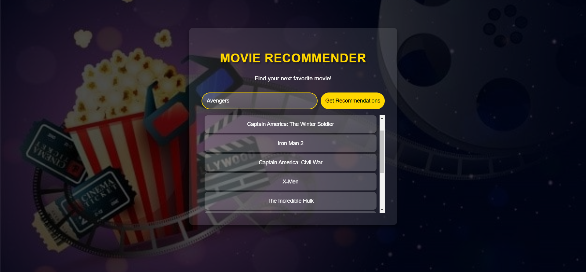
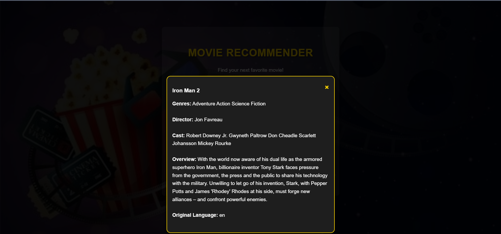

# Movie Recommendation System

This is a Python-based web application that recommends movies similar to a user-selected movie, using content-based filtering. The application includes an interactive frontend, connected to a backend that processes recommendations based on movie metadata.

## Table of Contents

- [About the Project](#about-the-project)
- [Features](#features)
- [Project Structure](#project-structure)
- [Data Requirements](#data-requirements)
- [Getting Started](#getting-started)
  - [Prerequisites](#prerequisites)
  - [Installation](#installation)
- [Usage](#usage)
- [Output Images](#output-images)
- [Built With](#built-with)
- [Acknowledgments](#acknowledgments)

## About the Project

The Movie Recommendation System is designed to help users discover new movies similar to their favorites. By entering a movie title, users receive a list of top recommendations based on the selected movie’s attributes. Additional information about each recommended movie can be viewed in a modal popup.

## Features

- **Top 10 Similar Movies**: Recommends the top 10 movies similar to the user’s favorite.
- **Cosine Similarity Calculation**: Uses cosine similarity to calculate movie similarity based on selected features.
- **Error Handling**: Finds the closest match to the entered movie name, ensuring recommendations even for slight input errors.
- **Textual Data Processing**: Works with movie data to create feature vectors, enabling numerical similarity comparisons.
- **Interactive UI**: A responsive design displaying recommendations and details in a visually engaging format.
- **Modal Display**: Provides additional details (genres, director, cast) for each recommended movie in a popup modal.

## Project Structure

The project consists of the following main components:

- **Frontend**:
  - **HTML** (`index.html`): Structures the web page with a form for user input and a section for displaying recommendations.
  - **CSS** (`style.css`): Styles the page with layout, colors, animations, and responsive design elements.
- **Backend**:
  - **Python** (`web.py`): Handles server-side operations, processing requests for movie recommendations and fetching detailed information.

## Data Requirements

The code requires a CSV file with movie data, containing the following columns:

- `genres`
- `keywords`
- `tagline`
- `cast`
- `director`
- `overview`
- `original_language`
- `title`
- `index`

## Getting Started

To get a local copy of this project up and running, follow these steps.

### Prerequisites

- Python 3.x
- Required libraries:
  - `numpy`
  - `pandas`
  - `sklearn`
  - `difflib`
  - `scikit-learn`

### Installation

1. Clone the repository:
   ```sh
   git clone https://github.com/your-username/Movie-Recommendation-System.git
   ```
2. Navigate to the project directory:
   ```sh
   cd Movie-Recommendation-System
   ```
3. Install the required dependencies:
   ```sh
   pip install -r requirements.txt
   ```
4. Start the backend server:
   ```sh
   python web.py
   ```
5. Open `index.html` in a web browser to access the frontend.

## Usage

1. Open the application in your web browser.
2. Type the name of a movie in the input field and click "Get Recommendations."
3. A list of recommended movies will appear below the input form.
4. Click on any movie title to view more details in a modal popup.

## Output Images

### Main Page


### Recommendations List


### Movie Details Modal


## Built With

- **HTML/CSS** for frontend structure and styling.
- **JavaScript** for dynamic interaction in the frontend.
- **Flask (Python)** for backend functionality.
- **Machine Learning Libraries**: `numpy`, `pandas`, and `scikit-learn` for processing and calculating similarity.

## Acknowledgments

- Special thanks to online movie databases (such as TMDb or OMDb) for providing API access to movie information.
- This project was developed as part of a course or self-study project to enhance frontend and backend integration skills.

